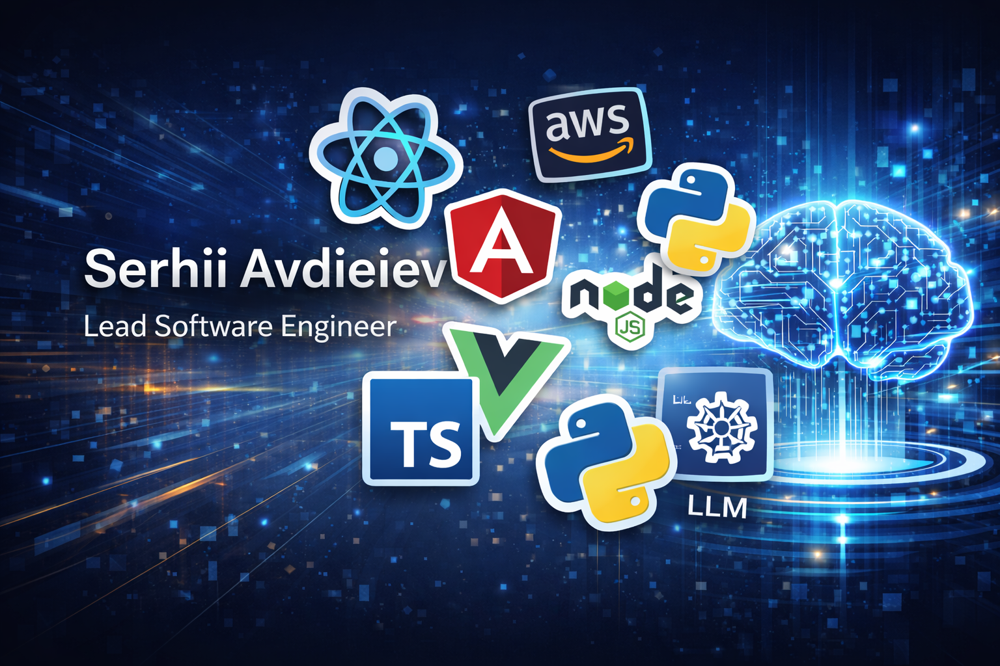

### Hi all, I'm Serhii Avdieiev - [Lead Frontend Engineer, Teacher and Mentor!](https://dev-you-need.vercel.app) 👋

I am a Lead Frontend Developer with more than 20 years of experience building high-performance, scalable web applications within the fintech, e-commerce, and media sectors. Throughout my career, I have balanced deep technical execution with architectural ownership and team leadership to deliver resilient and maintainable frontend systems.

In my most recent leadership roles, I have been responsible for defining frontend architecture and establishing the engineering standards that guide complex web platforms. My core expertise lies in React, Angular, TypeScript, Node.js, and implementing interfaces aligned with Web Content Accessibility Guidelines (WCAG), with a heavy focus on scalability and performance optimization. I have spearheaded major refactoring initiatives to eliminate technical debt and implemented strategies like code splitting and lazy loading to ensure high-speed user experiences. I believe that consistent code quality is achieved through structured review processes and rigorous testing practices.

Beyond the code, I prioritize the growth of the engineering team and the clarity of the product roadmap. I actively mentor developers, facilitate architectural discussions, and ensure that technical decisions are always aligned with broader business objectives. By collaborating closely with product managers, designers, and backend engineers, I translate complex requirements into practical solutions. I am particularly skilled at communicating technical trade-offs to non-technical stakeholders, ensuring that delivery timelines are both realistic and sustainable.

What distinguishes my approach as a Lead is the ability to think beyond individual features and toward the health of the entire ecosystem. I focus on building sustainable systems and improving engineering culture, which enables teams to deliver efficiently at scale. I take full ownership of technical decisions, always considering their long-term impact on product stability and development velocity.

I am consistently motivated by challenging environments where architecture, performance, and collaboration are treated as priorities. I thrive in roles that require a blend of hands-on technical mastery and high-level strategic thinking to drive real product value.

- 📍 I’m From Kyiv (Ukraine)
- 💻 20+ years of experience in development
- ♿ Strong experience implementing accessible UI aligned with WCAG standards
- 👨‍💻 Front-end Enthusiast
- 📚 Mentor

### 🤝 Connect with me:

### 🤝 Please check my 

---

### 💻 Tech Stack:

 
 
 
 
 
 
 
 
 
 
 
 
 
 
 
 
 
 
 
 
 
 
 
 
 
 
 
 
 
 
 
 
 
 
 
 
 
 
 

### 🛠 Tools:

 
 
 
 
 
 
 
 
 
 
 
 
 
 
 
 
 
 

---

### ⚙️ GitHub Analytics

|     |
| --- |
|     |

---